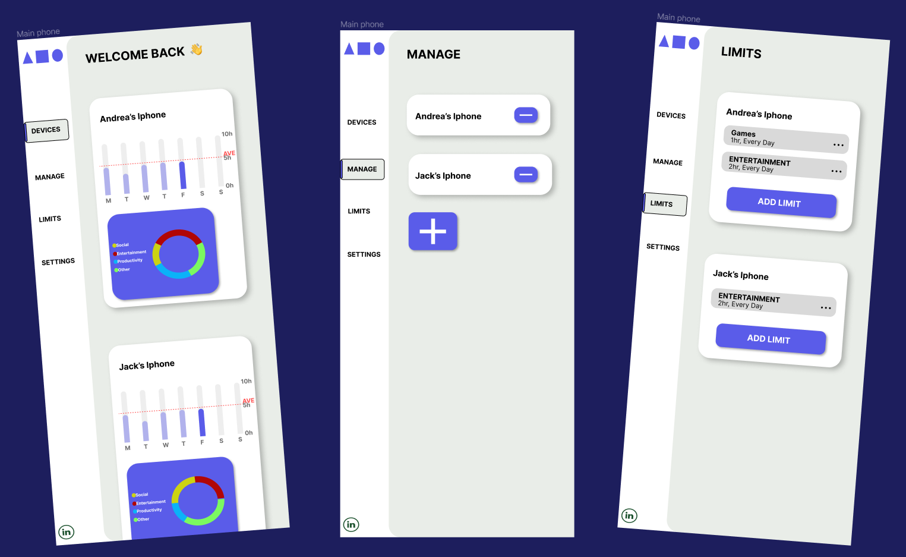

# ScreenTime Manager App **(STILL IN DEVELOPMENT)**
An iOS app designed to help you manage and take control of your family's screen time, by allowing them to make more mindful and productive use of your devices. This README will guide you through the features and functionalities of the app, helping you get started and make the most out of it.

## Table of Contents
- Features
- Getting Started
- Usage

# Features
ScreenTime Manager comes with a set of different features to help you manage your familys'' screen time effectively:

- Usage Tracking: Monitor how much time your kids spend on your devices and which apps you use the most.
- App Limits: Set daily or weekly limits for specific apps or categories to reduce excessive usage.
- Notifications: Receive timely notifications when your kid approach the predefined screen time limits.
- Reports: View detailed reports and statistics to track your kid's progress and make informed decisions.

# Usage
Launch the App: Open the ScreenTime Manager app on your device.
### Parents device
1. Create an Account: Sign up for a new account or log in if you already have one.
2. Grant Permissions: Give the app the necessary permissions to track your screen time and send notifications.
3. Set Limits: Configure screen time limits for specific apps or categories.
4. Monitor Usage: View your kid's screen time usage in the app's dashboard.
5. Review Reports: Analyze your kid's screen time habits using the detailed reports.
### Kids device
1. Create an Account: Sign up for a new account or log in if you already have one.
2. Enter unique code from parent's device
3. Grant Permissions: Give the app the necessary permissions to track your screen time and send notifications.
